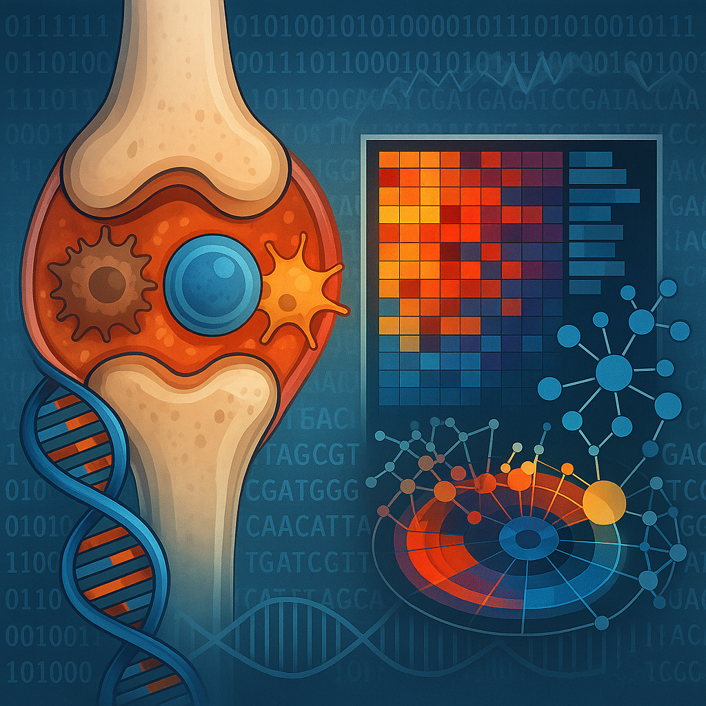

  

# Transcriptomics onthult immuungerelateerde genexpressie bij Reumatoïde Artritis (RA)

## 📁 Inhoud/structuur

- `Data/raw/` – Ruwe datasets die als input dienen voor de analyse. 
- `Data/processed` - Verwerkte datasets die zijn gegenereerd met behulp van scripts.
- `Scripts/` – R-scripts voor preprocessing, analyse en visualisatie.
- `Resultaten/` - Grafieken, tabellen en outputbestanden uit de analyses.
- `Bronnen/` - Externe bronnen zoals artikelen, handleidingen of databronnen. 
- `README.md` - Deze pagina met een toelichting op de projectstructuur en inhoud.
- `Voorblad/` - Documenten die horen bij de opmaak van het verslag
- `data_stewardship/` - Mappen en bestanden om aan te tonen hoe je de projectdata beheert.

---
## Introductie 

Reumatoïde artritis (RA) is een chronische auto-immuunziekte waarbij het immuunsysteem het eigen gewrichtsslijmvlies aanvalt. Dit leidt tot ontsteking, zwelling en uiteindelijk tot beschadiging van kraakbeen en bot. Hoewel de exacte oorzaak onbekend is, is er de afgelopen jaren veel vooruitgang geboekt in de behandeling ([Radu et al., 2021](Bronnen/Radu_2021_RA_management.pdf)).

Dankzij RNA-sequencing zijn er belangrijke genexpressiepatronen in RA ontdekt. Onderzoeken tonen aan dat genen betrokken bij het celskelet, evenals miRNA's, duidelijk anders tot expressie komen bij vroege RA in vergelijking met gezonde personen ([Platzer et al., 2019](Bronnen/Platzer_2019_RA_gene_expression.pdf)). RNA-sequencing maakt het mogelijk om differentieel tot exressie komende genen (DEGs) te indentificeren en deze te koppelen aan biologische processen zoals Gene Ontology (GO) en KEGG-pathways. Deze aanpak geeft meer inzicht in de moleculaire mechanismen van RA ([Zhang et al., 2022](Bronnen/Zhang_2022_RNA_sequencing.pdf)).

In dit project wordt met behulp van transcriptomische analyse onderzocht welke genen bij RA anders tot expressie komen dan bij gezonde personen en welke biologische processen daarbij betrokken zijn. Het doel is om via deze analyse meer inzicht te krijgen in de werking van RA op genetisch niveau.

## 🔬 Methode

Deze analyse gebruikt RNA-seq data van vier RA-patiënten en vier gezonde controles. De ruwe reads (FASTQ-bestanden) werden uitgelijnd op het humane referentiegenoom (GRCh38) met het `Rsubread`-pakket, waarna `.BAM`-bestanden werden gegenereerd. Deze zijn gesorteerd en geïndexeerd (`Data/processed/`).

Met `featureCounts()` werd een gen-telling uitgevoerd op basis van een GTF-bestand, resulterend in een count-matrix. De differentiële expressie-analyse werd uitgevoerd in `DESeq2`, waarbij log2 fold changes en aangepaste p-waardes (padj) werden berekend. De significante genen (padj < 0.05, |log2FC| > 1) zijn gevisualiseerd in een volcano plot.
Voor functionele interpretatie is een KEGG-pathwayanalyse uitgevoerd met `pathview`. De GO-enrichmentanalyse is uitgevoerd met `goseq`, met biascorrectie via een Probability Weighting Function. De top GO-termen zijn weergegeven in een dot plot.

Alle gebruikte scripts zijn te vinden in [`Scripts/Eigen data.R`](Scripts/Eigen_data.R). Zie het [flowschema](Resultaten/Flowschema.png) voor een overzicht van de workflow.

## 📊 Resultaten

Na kwaliteitscontrole en mapping zijn de reads succesvol uitgelijnd op het humane referentiegenoom GRCh38. Op basis van de gen-tellingen (`count_matrix_groot.csv`) werd met `DESeq2` een differentiële expressieanalyse uitgevoerd. Hieruit kwamen meerdere genen significant verschillend tot expressie tussen RA- en controlemonsters.

In de volcano plot ([VolcanoplotWC.png](Resultaten/VolcanoplotWC.png)) zijn deze DEGs visueel weergegeven. Genen met een p-waarde < 0.05 en |log2 fold change| > 1 zijn rood gekleurd; enkele opvallende genen met hoge expressieverandering zijn gelabeld.

Voor GO-analyse is eerst gecorrigeerd voor genlengtebias met een Probability Weighting Function ([pwf_plot.png](Resultaten/pwf_plot.png)). De daadwerkelijke GO-enrichment ([GO_resultaten_plot.png](Resultaten/GO_resultaten_plot.png)) toont dat termen gerelateerd aan immuunrespons, RNA-polymerase II-activiteit sterk verrijkt zijn onder de DE-genen.

De KEGG-pathwayanalyse ([hsa05323.pathview.png](Resultaten/hsa05323.pathview.png)) geeft inzicht in RA-gerelateerde signaalroutes. Genen zoals **IL6**, **IL1B**, en **TLR2/4** vertonen duidelijke opregulatie binnen het ‘Rheumatoid arthritis’ pathway.

Alle resultaten zijn opgeslagen in `Resultaten/`, inclusief de ruwe DESeq2-output (`Resultaten_RA_vs_Normal.csv`) en de gebruikte tellingen (`count_matrix_groot.csv`).

## ✅ Conclusie 

Deze transcriptomics-analyse heeft geleid tot de identificatie van meerdere differentieel tot expressie komende genen (DEGs) tussen RA-patiënten en gezonde individuen. Opvallend waren onder andere genen betrokken bij ontstekingsreacties en immuunactivatie, zoals IL6, TLR2/4 en CXCL-familieleden. De GO-enrichmentanalyse benadrukte vooral termen gerelateerd aan immuunrespons, RNA-polymeraseactiviteit en T-helpercel differentiatie. Deze resultaten zijn in lijn met bestaande literatuur over de rol van het immuunsysteem bij de pathogenese van RA.

De KEGG-pathwayanalyse van het ‘Rheumatoid arthritis’ signaalnetwerk bevestigde deze bevindingen visueel en toonde opregulatie van meerdere ontstekingsgerelateerde routes. De combinatie van genexpressieanalyse en functionele annotatie onderstreept het belang van transcriptomics bij het beter begrijpen van RA op moleculair niveau.

Hoewel het aantal monsters beperkt was (n = 8), bieden de resultaten een waardevolle eerste indruk van genregulatie bij RA. Toekomstig onderzoek zou kunnen uitbreiden met een groter cohort, differentiatie tussen vroege en late RA, en aanvullende celtype-specifieke analyse (bijv. single-cell RNA-seq). Verder validatie via qPCR of proteomics wordt aanbevolen om de biologische relevantie van deze genen in context van RA te bevestigen.

